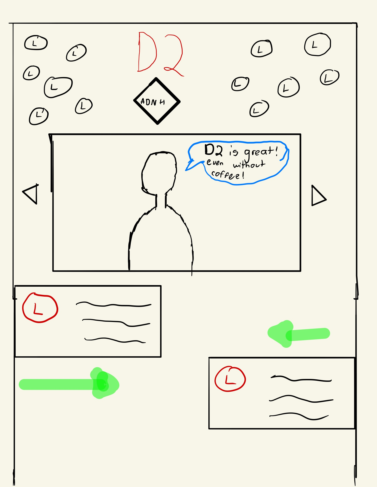
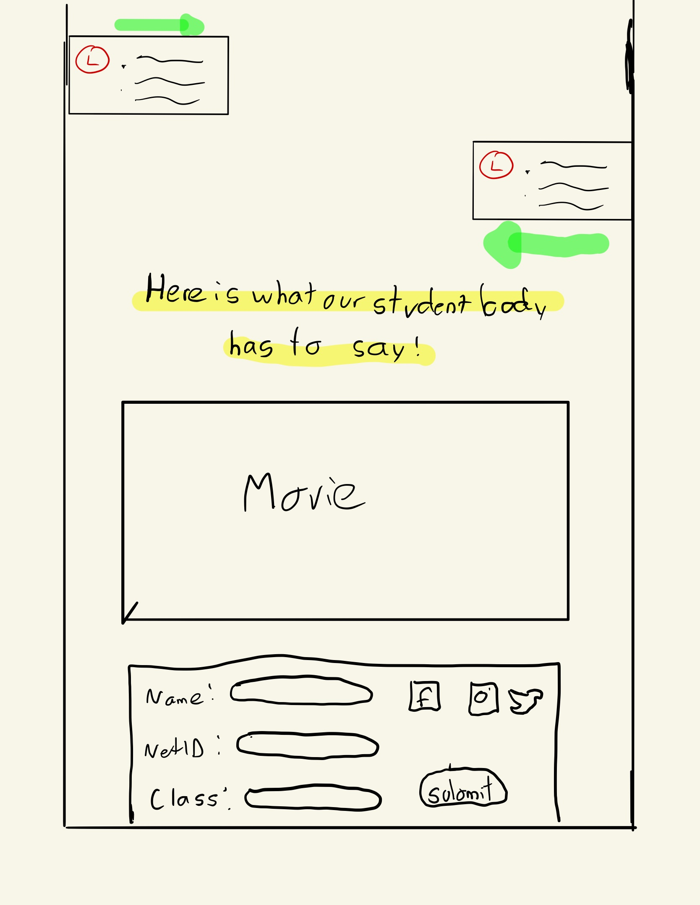
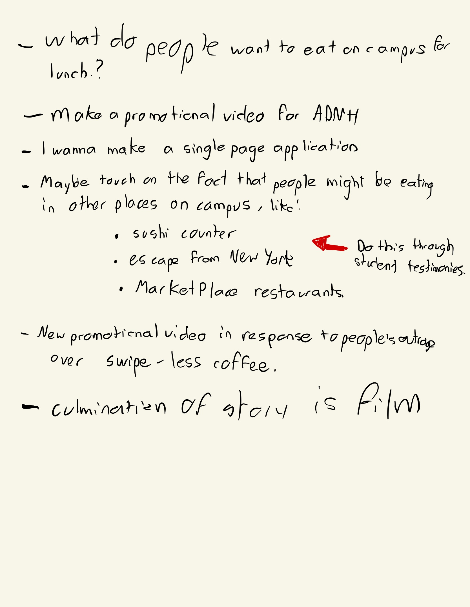

# Documentation

<h1><a href=":http://jfg388.nyuadim.com/Assignment_1/">Link to website</a></h1>

## Project Description

I'm an avid <a href="https://nyuad.nyu.edu/en/campus-life/housing/dining.html#tab-1-dining-halls">D2</a> fan. Coming from a high school where the food options were limited and underwhelming and being an avid eater myself, my jaw dropped during my first week in NYUAD due to the variety of top-quality options available to me. Such sentiment stuck without me all the way to January 2020, when the saddest food related nightmare in all of  my NYUAD college career became a reality. Coffee, an addiction I have  proudly maintained since my childhood, could no longer be bought with meal swipes. This event affected me deeply as I'm the type of person who needs coffee to function throughout the day, especially this semester as I have a morning class every day of the week. Saving campus dirhams for other commodities like soap, toilet papers, or eating at other food venues in NYUAD became unimportant compared to the energy burst I get after drinking an iced americano every morning. In light of the aforementioned, I decided to pass the 30 minute Film Festival video (30MFF) I made in class, which just happened to be a bunch of NYUAD students telling us in front of the camera what they were going to eat for lunch, as a promotional video the D2 staff made for their new advertisement website. In my mind, this advertisement website spurred as a result of the controversies in NYUAD’s Room of Requirement Facebook Page, the online destination of student-related critiques and concerns. As such, I tried to make the website modern and neat, in hopes of creating a new visual identity for a place that is amidst a lot of animosity from its customers and replace such with an attractive website that can remind people of the cool place D2 once was when it used to allow meal swipes for coffee.

## Project Implementation

My original idea was to have student testimonies in a photo carousel under the title as my main attractive interaction. However, as I started coding the website, my original idea morphed into something more interactive that I'm more happy about. My main interaction under the title is a photo grid that I made using CSS’s  flexbox as advised by Professor Sarah. This 4 X 4 matrix contains a picture of each of the restaurants in D2 with the leftmost grid containing a new D2 logo I created and the rightmost grid being the logo for 30MFF. Why did I include such logos in the restaurant photo grid? Because the grid serves as the canvas of a pacman animation that starts in the D2 logo, goes from left to right and top to bottom through the grid eating each logo in its way, and ends in the 30MFF logo. The pacman is first sad when it first sits on top of the D2 logo, but then notices to its right the logos he can eat and gets content after eating all of them when it arrives to the final grid. I first tried doing the animation using Javascript’s (JS) Time library but it was difficult to overcome the “asynchronousity” of JS. A simple turnaround to this issue was to use JS’s requestAnimationFrame function and then adjusted the frame rate according to the speed I wanted for the animation. The animation itself is just a draw function where I change the source of the image according to a counter variable.  The main reason behind this animation is to make a palpable representation of the happy journey the possible D2 customer will go through every time he chooses to eat at D2. I figured that a juvenile way of representing such a path would be to use Pacman, a game all possible D2 customers would have played at least once. I also added Pacman’s eating sounds to further immerse the user into the pacman animation occuring in front of him. 

Another layer of animation I added to my photo grid was to scroll down the user to the place within the html page where the information of the restaurant is after the user clicks on the corresponding restaurant’s image in the photogrid. The reason behind this was that I've been trying to learn how to create Single Page Applications(SPAs) that give a feel of a more complex, multi-page website. Also, I wanted to brush up on my JS and Jquery skills. The scroll down itself resulted in a 3 line function made with Jquery, so it wasn't that difficult to  implement at all. I also added a fixed upward arrow on the bottom right corner of the page so the user can scroll up whenever he wants to, facilitating the User Experience of reading different restaurant descriptions.

The last two div elements in the web page are the Starbucks description and the 30MFF video and description. The Starbucks description pops up above other restaurant descriptions as evidenced by it being centered on the page as opposed to the left and right alternating alignment of the previous div elements. In addition to including a brief description of its F&B offerings, the D2 staff wrote a form of apology letter to the NYUAD student community explaining its decision of not allowing meal swipes for coffee. I was thinking of adding stylistic choices to the description that would make it pop up above the rest of the text, but I chose to not do it to maintain the minimalist design patterns I established in the previous restaurant descriptions.

## Reflection/Evaluation

Overall, I am very content with the result. In particular, I was fascinated by the design choices I implemented along the way and how those deviated from my initial conception of the final product. Every time I implemented something major, I would user test with my friends to see if they liked it. This iterative process contributed to the final result of the website, and I am definitely indebted to my friend Steven Wyks for his suggestions on the pacman animation and his incredible CSS debugging skills and my friend Emily Broad who helped me with the idea of spinning the 30MFF video as an advertisement video for D2/ADNH.

## Wireframes

Below are the original wireframes I designed and feedback notes I jot down for the website. As you can see, the final look of the site ended up being very different than intended. 

