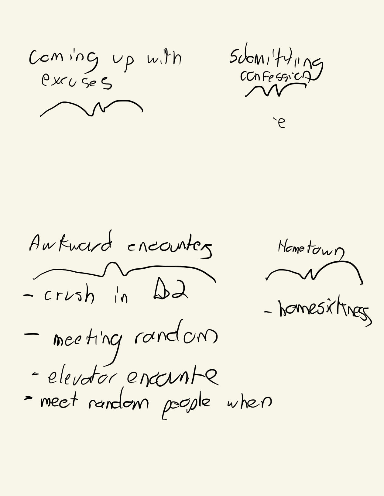
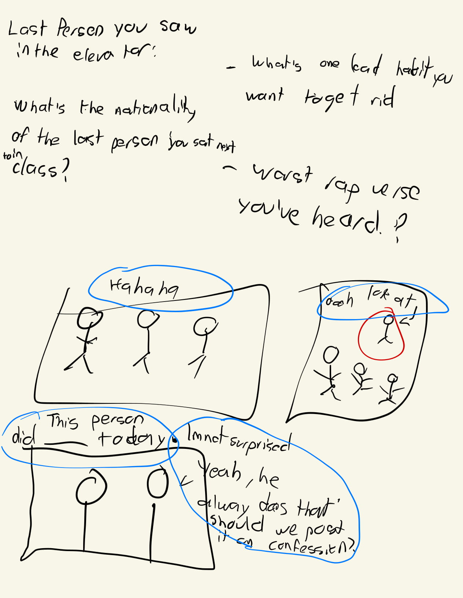
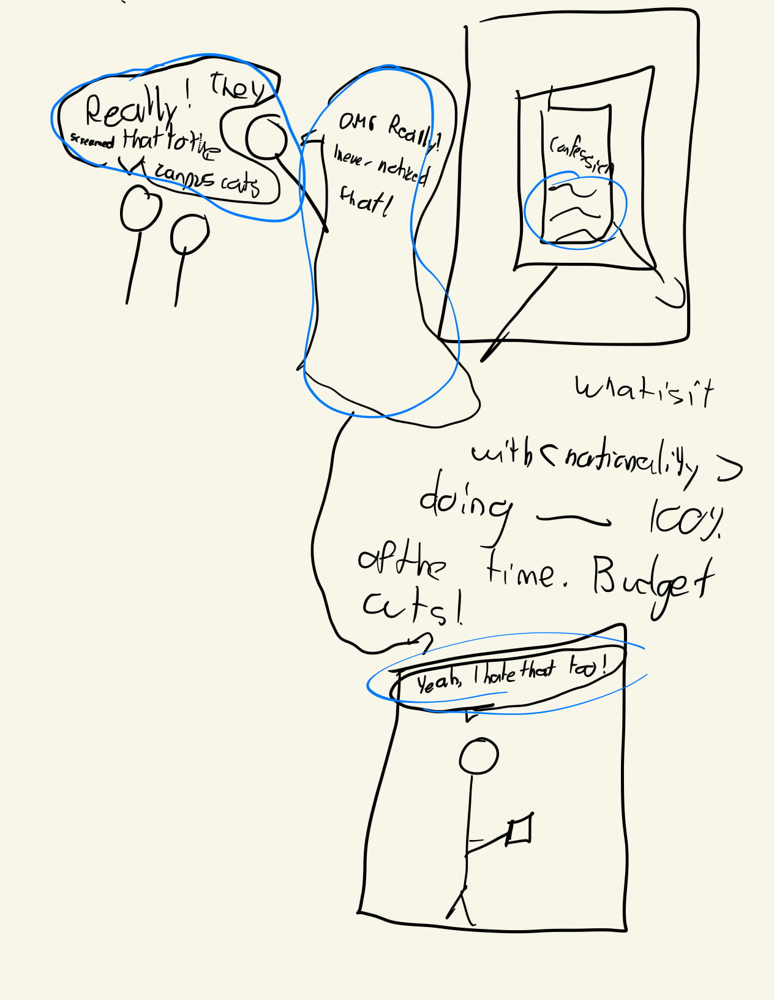
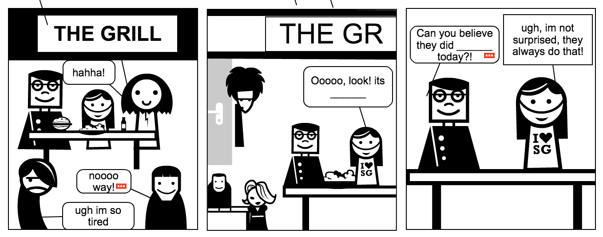
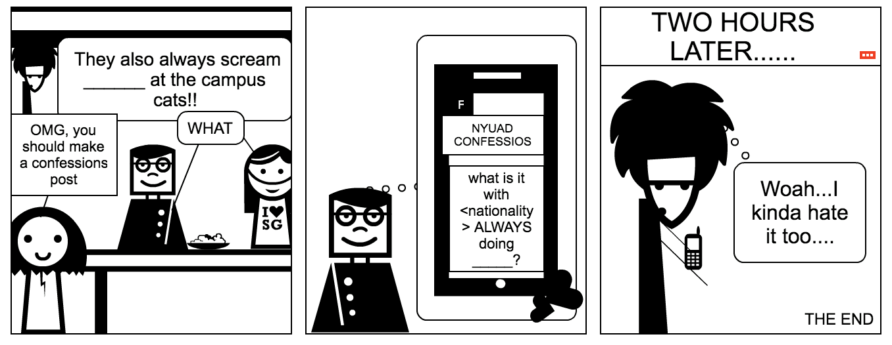

<a href="http://jfg388.nyuadim.com/Assignment_2/index.html">Link to Website</a>

## Project Description

I like to follow funny and relatable pages on Facebook. If I don't rigorously monitor my phone usage, I could possibly spend an entire day scrolling through meme posts on Facebook. One page in particular I am not a big fan of is NYUAD Confessions. This page is used as a platform for NYUAD students to voice their concerns and gossip about the typical happenings of an NYUAD student. However, I often feel like all the posts are of the same tone and similar content, often along the lines of a student complaining about something or someone related to the NYUAD experience. This pushed me to think of a way of recreating the generic posts that are on the page. I am also interested in the idea of audience participation in different storytelling forms, something I have been challenged by in different projects in the past.  Can something as rigid and structured as a story work whenever it depends on an unpredictable response from the audience? In light of the aforementioned, me and my partner Deena created a Confessions Experience generator, an interactive web comic experience that depends on the user answering 4 questions. Such questions were created keeping the NYUAD students in mind while also being generic enough for any millenial to be able to answer. 

## Process 

I was in charge of coding and designing the website, while Deena was in charge of drawing the comic panels. We both came up with the questions and  the storyline. Below is a picture of our first brainstorming session, and the different prototypes we made along the way in order to deliver the final result. A disclaimer, I tend to make notes that make no sense so I apologize if you can't make sense of them. I love the feeling that comes from looking at the final result in comparison to the incomprehensible mess that are my initial notes and drawings. 

First Brainstorming Session:

First Protype: 

The website was created using HTML, CSS, Javascript, with a particular reliance on Animate on Scroll (AOS.js) for the fading animations in the initial panel, Jquery for user-input manipulation, and snap-align (CSS property) for the comic’s scroll snapping experience. The web comics are  first hidden to the user using Jquery, and the user must answer the questions and submit the form for the comic panels to appear. I initially wanted to somehow “disable scrolling” for the user, but the aforementioned proved to be easier to implement.  The user input is then preprocessed using jquery and javascript and then placed on a div element that lies on top of the image. This div element  is placed specifically where it needs to be on the panel’s text bubble, a position that is hardcoded in the div element’s CSS property but also designed to be responsive using relative positioning in respect to the size of the image on the viewport using percentage sizing. The snap-align CSS property allows for the user to snap through the different comic panels, an experience that resembles flipping different pages of a comic book. At the end, the page is reloaded using jquery after the user clicks on the text that says “Click here to generate a new Confessions Experience”. 

## Reflection/Evaluation
All in all, I believe we did a good job of incorporating user input to our comic. What I particularly liked is how even if the user inputs gibberish, mispronounced words, or incoherent responses into the form, the Confession that is generated is still credible as a lot of the Confessions that get posted (or general millenial facebook posts for that matter) tend to not always make complete sense. Something that we also wanted to address is how people tend to ride the influence wave created by social media postings, a wave that without us noticing, might also be targeted to us (this was addressed by the final twist ending of our comic).
